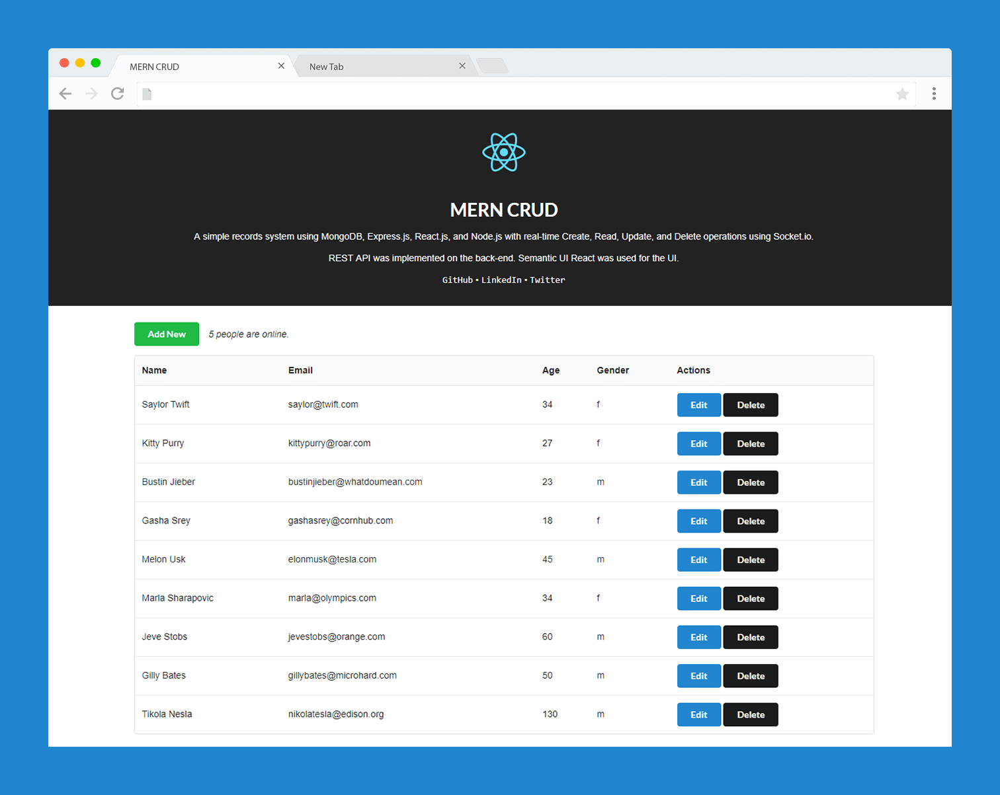

# MERN CRUD

A simple records system using MongoDB, Express.js, React.js, and Node.js with real-time Create, Read, Update, and Delete operations using Socket.io. REST API was implemented on the back-end. Semantic UI React was used for the UI.


Demo: [https://mern-crud.herokuapp.com/](https://mern-crud.herokuapp.com/)



## Show Some :heart: :wave:
[](https://github.com/cefjoeii/mern-crud)
[](https://github.com/cefjoeii/mern-crud/fork)
[](https://github.com/cefjoeii/mern-crud)

[](https://github.com/cefjoeii)
[](https://facebook.com/cefjoeii)
[](https://instagram.com/cefjoeii)
[](https://twitter.com/cefjoeii)

## Instructions

Fork, then download or clone the repo.
```bash
git clone https://github.com/<your-user-name>/mern-crud.git
```


*Make sure MongoDB service is running.*

The *config* folder contains a file named *db.js*. Before running locally, change the value of db as seen in the code below.
```js
module.exports = {
  db: 'mongodb://localhost/mern-crud'
};
```

For the **back-end**, install the dependencies once via the terminal.
```bash
npm install
```

Run the *main server*. It listens on port 3000.
```bash
CORS=1 node server
```
View it on the browser.

<br>

If you want to configure the **front-end**, go to *react-src* folder via the terminal.

```bash
cd react-src
```

Install the dependencies required by React once.
```bash
npm install
```

Run the *development server* for React. It listens on port 4200.
```bash
REACT_APP_API_URL=http://localhost:3000 npm start
```

To make a production build, simply run on *react-src* folder via the terminal.
```bash
npm run build
```

It re-creates a folder named *public* on the root directory. This is where the production-ready front-end of the web application resides.

## Docker
```bash
docker-compose up
```


## Contribute
Feel free to help out as I may have other work/life commitments. See [CONTRIBUTING.md](CONTRIBUTING.md).

## To Do

- [x] Create
- [x] Read
- [x] Update
- [x] Delete
- [x] Real-time broadcast using Socket.io
- [x] Deploy in Heroku
- [x] Front-end validation (HTML)

## License
* [MIT](LICENSE)
